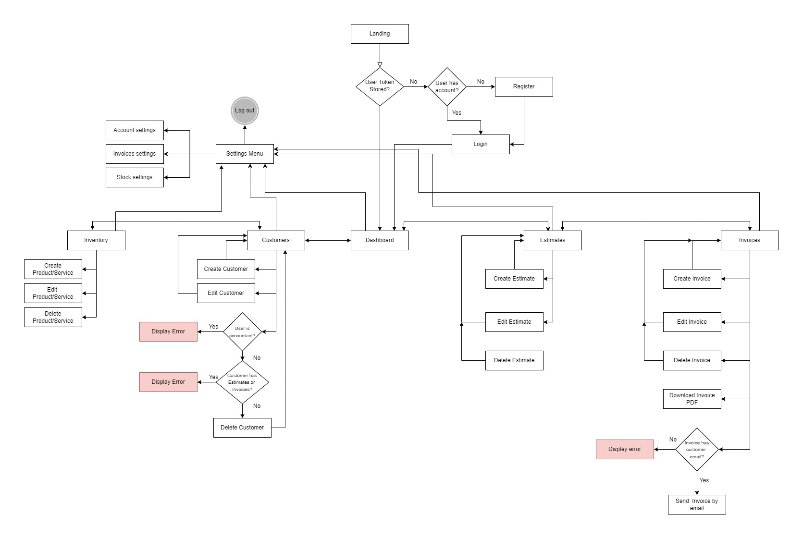

# easyFinances APP // AccountIt APP // BAM Online (Business Account Management)

## Introduction

This app will make your finances much easier. Forget about headaches when creating invoices, managing inventory...

Use an All-in-One app to create Estimates, Invoices, Manage Stock, (future versions will also allow you to integrate all the accounting of your company)

And all of that available anywhere, anytime thanks to its compatibility with all web devices. Forgot installing heavy programs on your computer.

## Functional Description

- On creating a new account, a new company will be registered with new User details
    - That new User will be the admin of that company

- New companies can also be registered with Google Account

- (TODO) Admin can register new accounts for employees and accountants (With diferent permissions) on settings panel.

- On APP, users can manage Customers, Inventory, Estimates and Invoices.

- Manage customers
    - Create customer (Name, email, phone, legalId, billing address, shipping address, pay terms, website)
        - Only name is required to create a customer
        - Customer Name is unique per company
    - Edit customer info
    - Delete customer
        - Accountant users does not have permission to delete customers
        - To delete a customer, companies can't have any estimate or invoice linked with that customer
    - Customers table will display Customer name, phone and (TODO) Balance and can be sorted with any of these fields

- Manage Inventory
    - Create product/service (Name, SKU, category, product description, purchase cost, initial stock, safety stock quantity)
        - Name and SKU are required
        - Name and SKU are unique per company
    - Edit product/service
        - TODO: Adjust stock quantity manually
    - Delete product/service
        - Accountant users does not have permission to delete products/services
    - Inventory table will display Product/Service name, SKU, category, cost price, min Qty and stock and can be sorted with any of these fields

- Manage Estimates
    - Create estimate
        - On clicking new estimate a new form will appear to enter select customer and introduce the estimate Data.
        - On selecting a customer, all customer inputs will fill with default information from customer panel.
        - The next fields are required:
            - Customer
            - Estimate N#
            - Estimate date
            - Products (At least 1 product should be correctly filled)
                - Product name / QTY / Unit price / TAX are required if at least one of the mentioned fields are filled
                - Total amount will be calculated automatically
        - Estimates will no modify stock from inventory, since the order it's not confirmed yet
    - Edit estimate
        - On clicking edit estimate, same form as new estimate will open, but filled automatically with estimate details
        - On this form, you can't change customer.
    - Delete estimate
        - On clicking delete estimate, a confirm dialog will appear. If you confirm, estimate will be deleted and there is no way to revert that
    - Estimate table will display Date, Customer name, Estimate N#, Status and amount and can be sorted with any of these fields
    - TODO: Convert estimate to Invoice automatically
    - TODO: Download estimate PDF and send to customer by email

- Manage Invoices
    - Create invoice
        - Same form as new estimate, but with few minor changes
        - Invoices will modify stock automatically
    - Edit invoice
        - Same as edit estimate
    - Delete invoice
        - Same as delete estimate
        - Deleting an invoice will adjust stock automatically
    - Invoice table will display same info than estimate Panel
    - Invoice toolbar has 2 additional buttons: Send Invoice and Print PDF
        - Send invoice will send to customer email address saved on the invoice. Will send an predefined message with the invoice PDF.
    
- FUTURE FUNCTIONS 
    - Add button on header to create faster all elements: Customers, Products, Estimates, Invoices
    - Searchbar on header to find all elements and enter on them to edit/send...
    - Complete settings panel
    - Dynamic reports on dashboard page (Invoice summary, Profit and Loss Summary, Stock summary...)
    - Integrate accounting functions
    - ...

- UI design (wireframes)

## Technical Description

- TODO: Sequence
- TODO: Components
- TODO: Code Coverage

### Blocks

### Data Model

User
- id: ObjectId
- name: String - req
- lastName: String - req
- email: String - req
- password: String - req
- company: ObjectId [Company] - req
- role: String - req (enum ['admin', 'accountant', 'employee'])

Company
- id: ObjectId
- name: String
- legalName: String
- legalId: String
- admin: ObjectId [User],
- users: [User]
- telephone: Number
- companyEmail: String
- customerFacingEmail: String
- postalAddress:
    - street: String
    - town: String
    - state: String
    - zipCode: Number
    - country: String
- physicalAddress:
    - street: String 
    - town: String
    - state: String
    - zipCode: Number
    - country: String
- sector: String
- website: String

Blacklist
- id: ObjectId
- token: String - req
- blackListedAt: Date
- expiresAt: Date

InventoryItem
- id: ObjectId
- company: ObjectId [Company] - req
- name: String - req
- sku: String
- category: String - req
- cost: Number
- averageCost: Number
- description: String
- minStock: Number
- stock: Number

Customer
- id: ObjectId
- company: ObjectId [Company] - req
- name: String - req
- contactName:
    - firstName: String
    - lastName: String
- email: String
- phone: Number
- website: String
- legalId: String
- billingAddress:
    - street: String 
    - town: String
    - state: String
    - zipCode: Number
    - country: String
- payTerms: String

Estimate:
- id: ObjectId
- comapny: ObjectId [Company] - req
- estimateNumber: String - req 
- customer:
    - refId: ObjectId [Customer] - req
    - name: String - req
    - billingAddress: String - req
    - shippingAddress: String - req
    - email: String - req
- terms: String - req
- estimateDate: Date - req
- products: TODO
- totalAmount: Number - req
- status: String - req (enum ['accepted', 'rejected', 'pending'])

Invoice
- id: ObjectId
- company: ObjectId [Company] - req
- invoiceNumber: String - req
- customer:
    - refId: ObjectId [Customer] - req
    - name: String - req
    - billingAddress: String - req
    - shippingAddress: String - req
    - email: String - req
- terms: String - req
- invoiceDate: Date - req
- dueDate: Date - req
- products : TODO
- balance: Number - req
- totalAmount: Number - req
- status: String - req (enum ['overdue', 'pending', 'paid'])

### Flow

### Technologies

- API
    - NodeJS
    - Express
    - MongoDB 
    - Libraries:
        - Mongoose
        - Mocha
        - Chai
        - Jsonwebtoken
        - Nodemailer
        - Pdfkit
        - Winston

- APP
    - React JS
    - Libraries:
        - Axios
        - react-google-login && gapi-script (Google login & register)
        - MUI (Tables)
        - Evergreen-ui (Dialog and Toaster)
        - react-transition-group (React render animations)

## Roadmap

Sprint 0 (05/09/2022 - 11/09/2022)

- DONE figma
- DONE data model
- DONE figma to react
- DONE data model to mongoose
- DONE populate data into db(populate.js)
- DONE implement users logic
- DONE implement users api routes
- DONE implement env file
- INPROGRESS API specs
- DONE use cases diagram
- INPROGRESS INPUT validations API
- INPROGRESS INPUT validations APP

Sprint 1 (12/09/2022 - 18/09/2022)

- DONE update Invoices/Inventory/Estimates/Customers from APP
- DONE delete Invoices/Inventory/Estimates/Customers from APP
- TODO search Invoices/Inventory/Estimates/Customers from APP
- TODO settings panel
- TODO make PLUS button on header interactive to create Invoices/Inventory/Estimates/Customers

Sprint 2 (19/09/2022 - 25/09/2022)

- DONE login image slider with features
- INPROGRESS design animations : Hover, submits, open menus, spinners...
- DONE Invoice PDF creator
- DONE Send invoice to customers by email

Sprint 3

- TODO search bar in header to find everything on APP
- TODO Finish pending tasks
- TODO Create new users linked to company(Only admins)

Sprint 4

- TODO Allow companies to change prefered currency and change all UI/Invoices/PDFs...
- TODO Show modal/form to write email body and change receivers on Invoice sending
- TODO Customize company logo and include in PDFs/Emails
- TODO logo design and use in Header & favicon
- TODO Use modal on logout instead of alert

Sprint 5

- TODO Design accounting API data models
- TODO Create accounting API data models to mongoose
- TODO Create accounting logics: (Profit & Loss / Balance)

....
